# Project-3
SIMPLE TO-DO APPLICATION ON MERN WEB STACK
 
 **In this project, we implement a web solution based on MERN stack in AWS Cloud.**

 **MERN Web stack consists of following components:**

 1. **MongoDB**: A document-based, No-SQL database used to store application data in a form of documents.

 2. **ExpressJS:** A server side Web Application framework for Node.js.

 3. **ReactJS:** A frontend framework developed by Facebook. It is based on JavaScript, used to build User Interface (UI) components.

4. **Node.js**: A JavaScript runtime environment. It is used to run JavaScript on a machine rather than in a browser.

## STEP 1 – BACKEND CONFIGURATION
**UPDATE UBUNTU**
 
 `sudo apt update`

**Upgrade Ubuntu**

`sudo apt upgrade`

We get the location of Node.js software from Ubuntu repostories.

`curl -fsSL https://deb.nodesource.com/setup_18.x | sudo -E bash -`

## Install Node.js on the server.

`sudo apt-get intsall -y nodejs`

**Note:** The command above installs both `nodejs` and `npm`. **NPM** is a package manager for Node like `apt` for Ubuntu, it is used to install Node modules and packages and to manage dependency conflicts.

**Next, Verify the node installation with the Command below :**

`node -v`

**Verify the node installation with the command below :**

`npm -v`

## Application Code Setup

## Create a new directory for your TO-DO project:

`mkdir Todo`

Run the command below to verify that the `Todo` directory is created with `ls` command.

`ls`

**TIP: In order to see some more useful information about files and directories, you can use following combination of keys ls -lih – it will show you different properties and size in human readable format. You can learn more about different useful keys for ls command with ls --help.**

**Change your current directory to the newly created one :**

`cd Todo`

**Use the command `npm init` to initialise your project, so that a new file named `package.json` will be created.**

 This file will normally contain information about your application and the dependencies that it needs to run. Follow the prompts after running the command. You can press `Enter `several times to accept default values, then accept to write out the `package.json` file by typing `yes`. 
 
 `npm init`
 
 Then Run `ls` to confirm it been created inside.

 The next is to create `Expressjs` and create the `Routes` directory.

 ## INSTALL EXPRESSJS

`npm install express` 

Create a file `index.js` with the command below

`touch index.js`

Run `ls` to confirm that your index.js file is successfully created.

**Install dotenv**

`npm install dotenv`

Open the `index.js` file with the command below

`vim index.js`

Copy and paste the code below ;

const express = require('express');
require('dotenv').config();

const app = express();

const port = process.env.PORT || 5000;

app.use((req, res, next) => {
res.header("Access-Control-Allow-Origin", "\*");
res.header("Access-Control-Allow-Headers", "Origin, X-Requested-With, Content-Type, Accept");
next();
});

app.use((req, res, next) => {
res.send('Welcome to Express');
});

app.listen(port, () => {
console.log(`Server running on port ${port}`)
});

**We have specified to use port 5000 in the code. This will be required later when we go on the browser.**

`node index.js`

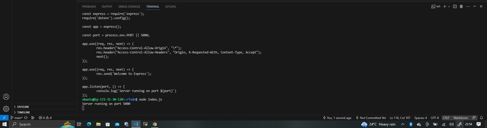

We have to open this Port 5000 in EC2 security Groups.

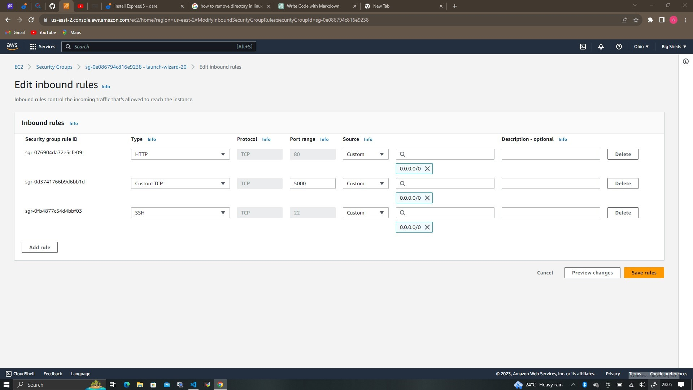

**We open our browser and try to access our server's Public IP or Public DNS name followed by port 5000 :**

`http://<PublicIP-or-PublicDNS>:5000`

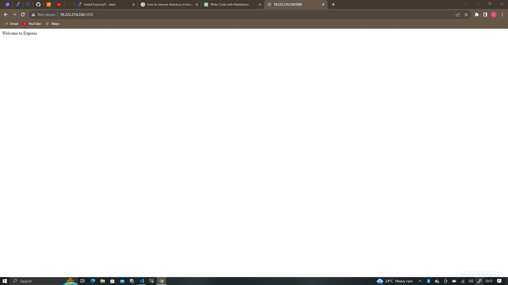

**Routes**

There are three actions our To-DO application needs to be able to do:

1. Create a new task
2. Display list of all tasks
3. Delete a completed

Each task will be associated with some particular endpoint and will use different standard **HTTP request methods: POST, GET, DELETE.**

For each task, we need to create routes that will define various endpoints that the **To-do** app will depend on. So let us create a folder **routes**

`mkdir routes`
 
 *We can open mulitple shells to connect to the same EC2*

 Change directory to **routes** folder.

 `cd routes`

We create a file `api.js` with the **touch** command;

`touch api.js`

Open the file `api.js` with **vim** command

`vim api.js`

*Copy the below code in the file* 

 const express = require ('express');
const router = express.Router();

router.get('/todos', (req, res, next) => {

});

router.post('/todos', (req, res, next) => {

});

router.delete('/todos/:id', (req, res, next) => {

})

module.exports = router;

**Let create `Models` directory next.**

# Models

Since the app is going to make use of Mongodb which is a NoSQL database, we need to create a model.
A model is at the heart of JavaScript based applications, and it is what makes it interactive.
We will also use models to define the database schema . This is important so that we will be able to define the fields stored in each Mongodb document.

To create a Schema and a model, install mongoose which is a Node.js package that makes working with mongodb easier.

**Change directory back Todo folder with cd .. and install Mongoose**

`npm install mongoose`

Create a new folder models :

`mkdir models`

change directory into the newly created 'models' folder

`cd models`

Inside the models folder, create a file and name it **todo.js**

`touch todo.js`

**Open the file created with `vim todo.js` then paste then paste the code below in the file :**

const mongoose = require('mongoose');
const Schema = mongoose.Schema;

//create schema for todo
const TodoSchema = new Schema({
action: {
type: String,
required: [true, 'The todo text field is required']
}
})

//create model for todo
const Todo = mongoose.model('todo', TodoSchema);

module.exports = Todo;

We need to update our `api.js` in 'routes' directory to make use of the new model.

In Routes directory, open api.js with `vim api.js`, delete the code inside with `:%d` command and paste there code below into it then save and exit.

const express = require ('express');
const router = express.Router();
const Todo = require('../models/todo');

router.get('/todos', (req, res, next) => {

//this will return all the data, exposing only the id and action field to the client
Todo.find({}, 'action')
.then(data => res.json(data))
.catch(next)
});

router.post('/todos', (req, res, next) => {
if(req.body.action){
Todo.create(req.body)
.then(data => res.json(data))
.catch(next)
}else {
res.json({
error: "The input field is empty"
})
}
});

router.delete('/todos/:id', (req, res, next) => {
Todo.findOneAndDelete({"_id": req.params.id})
.then(data => res.json(data))
.catch(next)
})

module.exports = router;

# MONGODB DATABASE

**MongoDB Database**

We need a database where we will store our data. For this we will make use of **mLab**. mLab provides MongoDB database as a service solution (DBaaS), so to make life easy, you will need to sign up for a shared clusters free account, which is ideal for our use case. Sign up here. Follow the sign up process, select **AWS** as the cloud provider, and choose a region near you.

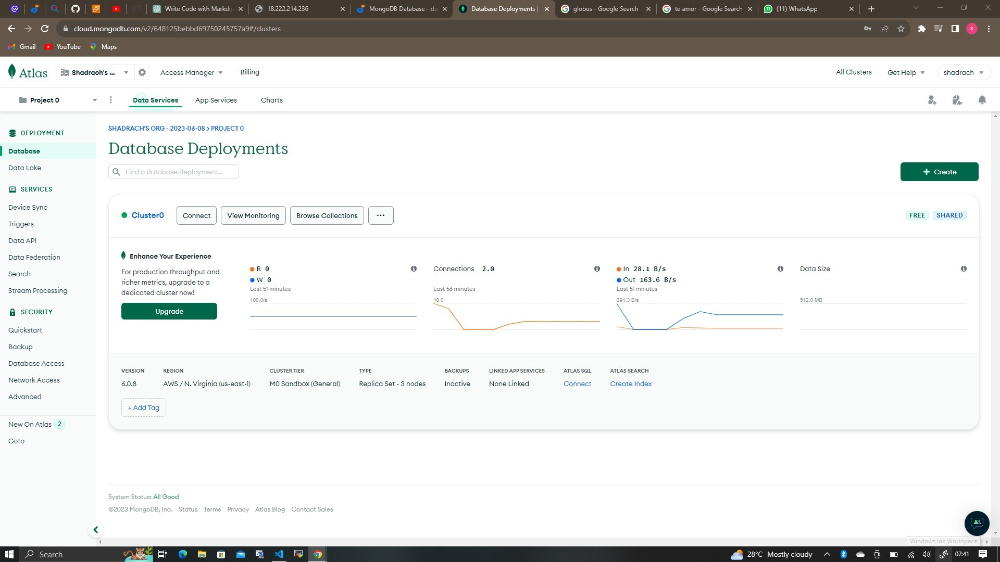

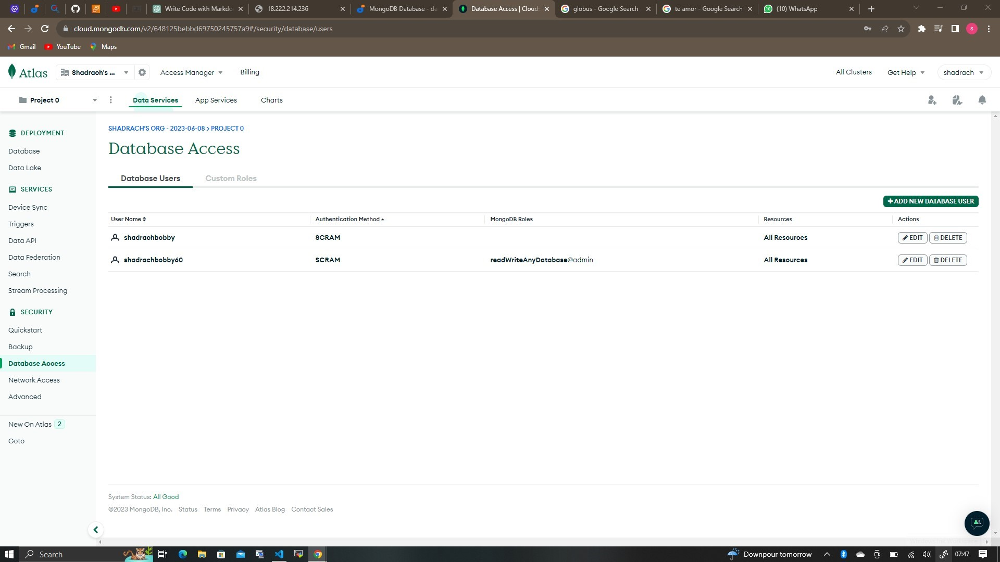

**Allow access to the MongoDB database from anywhere (Not secure, but it is ideal for testing). Make sure you change the time of deleting the entry from 6hours to 1 week.**

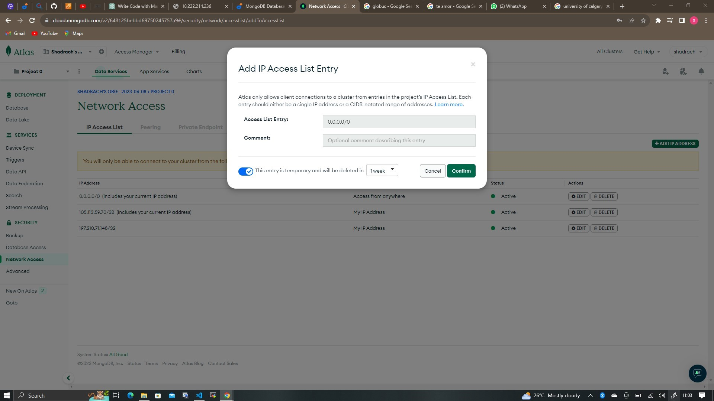

In the `index.js` file we specified `process.env` to access environment varaibles, but we have not yet created this file. So we need to do that.

Create a file in your `Todo` directory and name it `.env`, **Run :**

`touch .env`
`vi .env`

Add the connection string to access the database in it, just as below:

`DB = 'mongodb+srv://<username>:<password>@<network-address>/<dbname>?retryWrites=true&w=majority'`

**NOTE :** Ensure to update <username>, <password>, <network-address> and <database> according to your setup

Here is how to get your connection string.

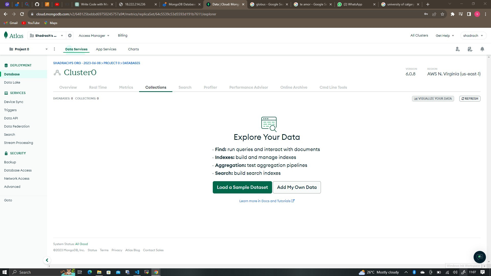
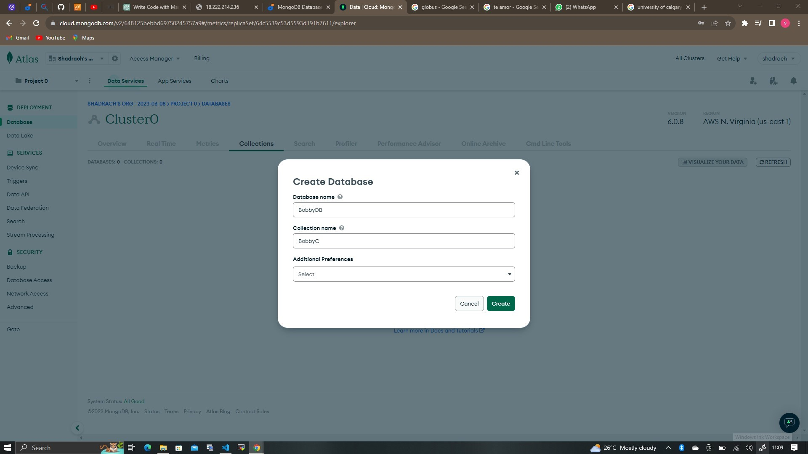
 
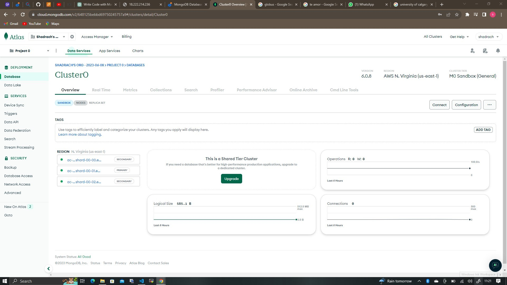

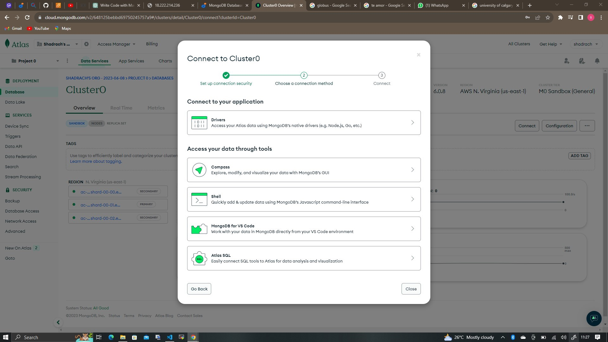

We need to update the `index.js` to reflect the use of `.env` so that Node.js can connect to the database.

Delete existing content inthe file, and update it with the entire code below.

To do that using `vim` follow below steps;

1. Open the file with `vim index.js`
2. press `esc`
3. Type `:`
4. Type `%d`
5. Hit 'Enter'

The entire content will be deleted, then,

6. Press `i` to enter the insert mode in vim

7. Now, paste the entire code below in the file.

`
const express = require('express');
const bodyParser = require('body-parser');
const mongoose = require('mongoose');
const routes = require('./routes/api');
const path = require('path');
require('dotenv').config();

const app = express();

const port = process.env.PORT || 5000;

//connect to the database
mongoose.connect(process.env.DB, { useNewUrlParser: true, useUnifiedTopology: true })
.then(() => console.log(`Database connected successfully`))
.catch(err => console.log(err));

//since mongoose promise is depreciated, we overide it with node's promise
mongoose.Promise = global.Promise;

app.use((req, res, next) => {
res.header("Access-Control-Allow-Origin", "\*");
res.header("Access-Control-Allow-Headers", "Origin, X-Requested-With, Content-Type, Accept");
next();
});

app.use(bodyParser.json());

app.use('/api', routes);

app.use((err, req, res, next) => {
console.log(err);
next();
});

app.listen(port, () => {
console.log(`Server running on port ${port}`)
});

`

**NOTE :** Using environment variables to store information is considered more secure and best practice to separate configuration and secret data from the application, instead of writing connection strings directly inside the index.js application file.

Start the server using the command
`node index.js`
**You shall see a message ‘Database connected successfully’, if so – we have our backend configured. Now we are going to test it.**

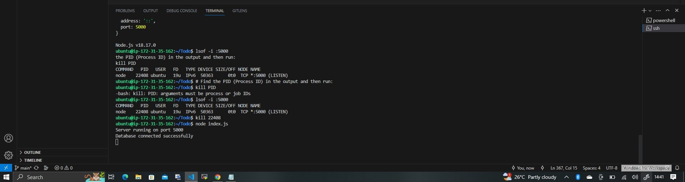

### Testing Backend Code without Frontend using RESTful API