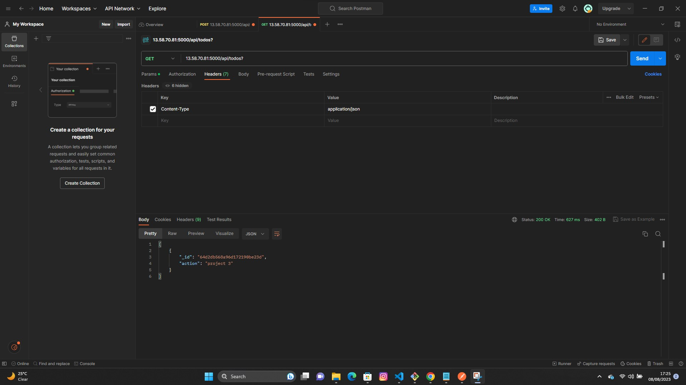
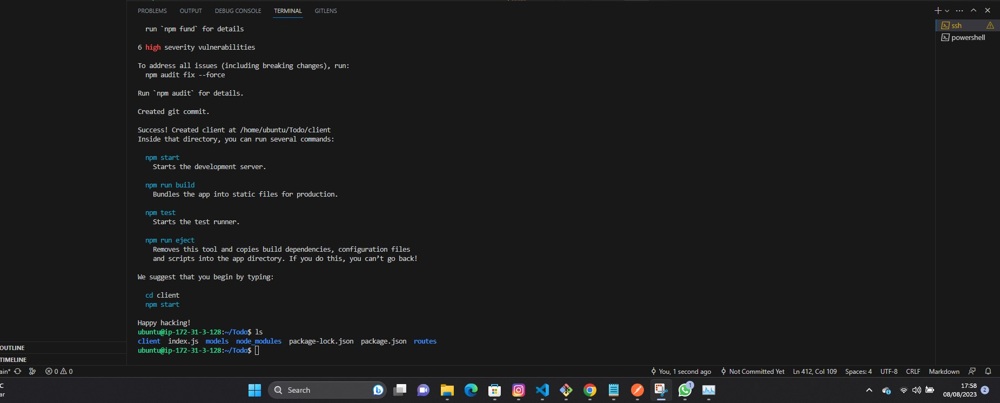
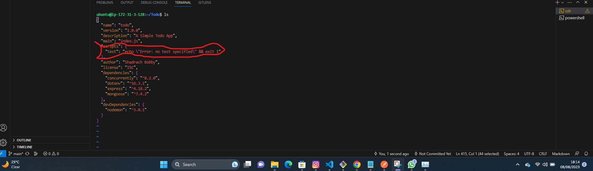
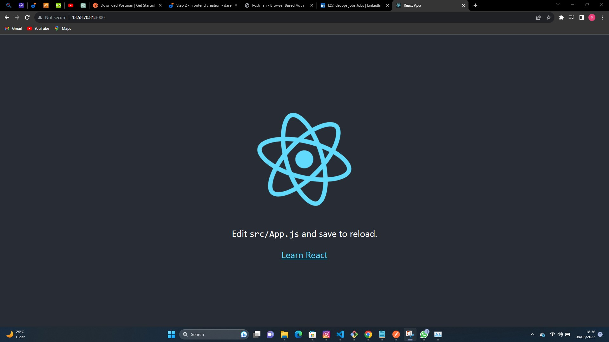
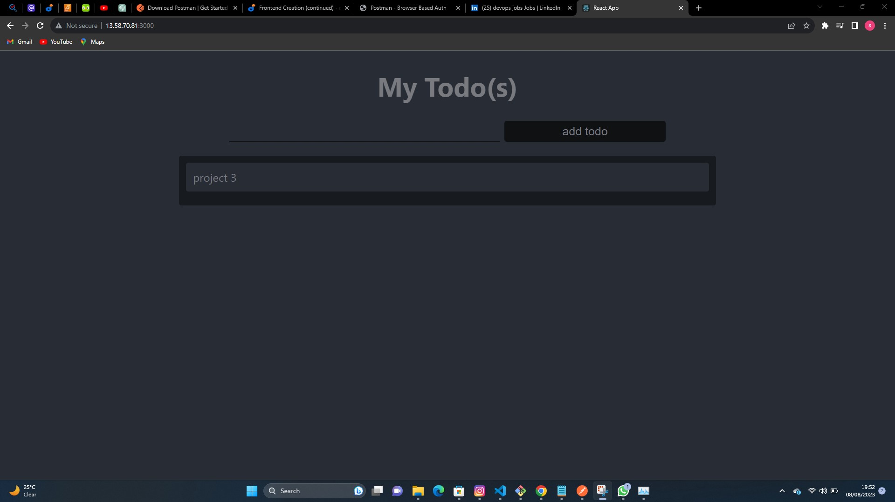

# Project-3
SIMPLE TO-DO APPLICATION ON MERN WEB STACK
 
 **In this project, we implement a web solution based on MERN stack in AWS Cloud.**

 **MERN Web stack consists of following components:**

 1. **MongoDB**: A document-based, No-SQL database used to store application data in a form of documents.

 2. **ExpressJS:** A server side Web Application framework for Node.js.

 3. **ReactJS:** A frontend framework developed by Facebook. It is based on JavaScript, used to build User Interface (UI) components.


4. **Node.js**: A JavaScript runtime environment. It is used to run JavaScript on a machine rather than in a browser.

## STEP 1 – BACKEND CONFIGURATION
**UPDATE UBUNTU**
 
 `sudo apt update`

**Upgrade Ubuntu**

`sudo apt upgrade`

We get the location of Node.js software from Ubuntu repostories.

`curl -fsSL https://deb.nodesource.com/setup_18.x | sudo -E bash -`

## Install Node.js on the server.

`sudo apt-get intsall -y nodejs`

**Note:** The command above installs both `nodejs` and `npm`. **NPM** is a package manager for Node like `apt` for Ubuntu, it is used to install Node modules and packages and to manage dependency conflicts.

**Next, Verify the node installation with the Command below :**

`node -v`

**Verify the node installation with the command below :**

`npm -v`

## Application Code Setup

## Create a new directory for your TO-DO project:

`mkdir Todo`

Run the command below to verify that the `Todo` directory is created with `ls` command.

`ls`

**TIP: In order to see some more useful information about files and directories, you can use following combination of keys ls -lih – it will show you different properties and size in human readable format. You can learn more about different useful keys for ls command with ls --help.**

**Change your current directory to the newly created one :**

`cd Todo`


**Use the command `npm init` to initialise your project, so that a new file named `package.json` will be created.**

 This file will normally contain information about your application and the dependencies that it needs to run. Follow the prompts after running the command. You can press `Enter `several times to accept default values, then accept to write out the `package.json` file by typing `yes`. 
 
 `npm init`
 
 Then Run `ls` to confirm it been created inside.

 The next is to create `Expressjs` and create the `Routes` directory.


 ## INSTALL EXPRESSJS

`npm install express` 

Create a file `index.js` with the command below

`touch index.js`

Run `ls` to confirm that your index.js file is successfully created.

**Install dotenv**

`npm install dotenv`

Open the `index.js` file with the command below

`vim index.js`

Copy and paste the code below ;


```
const express = require('express');
require('dotenv').config();

const app = express();

const port = process.env.PORT || 5000;

app.use((req, res, next) => {
res.header("Access-Control-Allow-Origin", "\*");
res.header("Access-Control-Allow-Headers", "Origin, X-Requested-With, Content-Type, Accept");
next();
});

app.use((req, res, next) => {
res.send('Welcome to Express');
});

app.listen(port, () => {
console.log(`Server running on port ${port}`)
});
```

app.listen(port, () => {
console.log(`Server running on port ${port}`)
});


**We have specified to use port 5000 in the code. This will be required later when we go on the browser.**

`node index.js`


We have to open this Port 5000 in EC2 security Groups.


**We open our browser and try to access our server's Public IP or Public DNS name followed by port 5000 :**

`http://<PublicIP-or-PublicDNS>:5000`


**Routes**

There are three actions our To-DO application needs to be able to do:

1. Create a new task
2. Display list of all tasks
3. Delete a completed

Each task will be associated with some particular endpoint and will use different standard **HTTP request methods: POST, GET, DELETE.**

For each task, we need to create routes that will define various endpoints that the **To-do** app will depend on. So let us create a folder **routes**

`mkdir routes`
 
 *We can open mulitple shells to connect to the same EC2*

 Change directory to **routes** folder.

 `cd routes`

We create a file `api.js` with the **touch** command;

`touch api.js`

Open the file `api.js` with **vim** command

`vim api.js`

*Copy the below code in the file* 

 ```
 const express = require ('express');
const router = express.Router();

router.get('/todos', (req, res, next) => {

});

router.post('/todos', (req, res, next) => {

});

router.delete('/todos/:id', (req, res, next) => {

})

module.exports = router;
 ```

**Let create `Models` directory next.**

# Models

Since the app is going to make use of Mongodb which is a NoSQL database, we need to create a model.
A model is at the heart of JavaScript based applications, and it is what makes it interactive.
We will also use models to define the database schema . This is important so that we will be able to define the fields stored in each Mongodb document.

To create a Schema and a model, install mongoose which is a Node.js package that makes working with mongodb easier.

**Change directory back Todo folder with cd .. and install Mongoose**

`npm install mongoose`

Create a new folder models :

`mkdir models`

change directory into the newly created 'models' folder

`cd models`

Inside the models folder, create a file and name it **todo.js**


`touch todo.js`

**Open the file created with `vim todo.js` then paste then paste the code below in the file :**

```
const mongoose = require('mongoose');
const Schema = mongoose.Schema;

//create schema for todo
const TodoSchema = new Schema({
action: {
type: String,
required: [true, 'The todo text field is required']
}
})

//create model for todo
const Todo = mongoose.model('todo', TodoSchema);

module.exports = Todo;
```

We need to update our `api.js` in 'routes' directory to make use of the new model.

In Routes directory, open api.js with `vim api.js`, delete the code inside with `:%d` command and paste there code below into it then save and exit.


```
const express = require ('express');
const router = express.Router();
const Todo = require('../models/todo');

router.get('/todos', (req, res, next) => {

//this will return all the data, exposing only the id and action field to the client
Todo.find({}, 'action')
.then(data => res.json(data))
.catch(next)
});

router.post('/todos', (req, res, next) => {
if(req.body.action){
Todo.create(req.body)
.then(data => res.json(data))
.catch(next)
}else {
res.json({
error: "The input field is empty"
})
}
});

router.delete('/todos/:id', (req, res, next) => {
Todo.findOneAndDelete({"_id": req.params.id})
.then(data => res.json(data))
.catch(next)
})

module.exports = router;
```


# MONGODB DATABASE

**MongoDB Database**

We need a database where we will store our data. For this we will make use of **mLab**. mLab provides MongoDB database as a service solution (DBaaS), so to make life easy, you will need to sign up for a shared clusters free account, which is ideal for our use case. Sign up here. Follow the sign up process, select **AWS** as the cloud provider, and choose a region near you.


**Allow access to the MongoDB database from anywhere (Not secure, but it is ideal for testing). Make sure you change the time of deleting the entry from 6hours to 1 week.**


In the `index.js` file we specified `process.env` to access environment varaibles, but we have not yet created this file. So we need to do that.

Create a file in your `Todo` directory and name it `.env`, **Run :**

`touch .env`
`vi .env`

Add the connection string to access the database in it, just as below:

`DB = 'mongodb+srv://<username>:<password>@<network-address>/<dbname>?retryWrites=true&w=majority'`

**NOTE :** Ensure to update <username>, <password>, <network-address> and <database> according to your setup

Here is how to get your connection string.


 


We need to update the `index.js` to reflect the use of `.env` so that Node.js can connect to the database.

Delete existing content inthe file, and update it with the entire code below.

To do that using `vim` follow below steps;

1. Open the file with `vim index.js`
2. press `esc`
3. Type `:`
4. Type `%d`
5. Hit 'Enter'

The entire content will be deleted, then,

6. Press `i` to enter the insert mode in vim

7. Now, paste the entire code below in the file.

```
const express = require('express');
const bodyParser = require('body-parser');
const mongoose = require('mongoose');
const routes = require('./routes/api');
const path = require('path');
require('dotenv').config();

const app = express();

const port = process.env.PORT || 5000;

//connect to the database
mongoose.connect(process.env.DB, { useNewUrlParser: true, useUnifiedTopology: true })
.then(() => console.log(`Database connected successfully`))
.catch(err => console.log(err));

//since mongoose promise is depreciated, we overide it with node's promise
mongoose.Promise = global.Promise;

app.use((req, res, next) => {
res.header("Access-Control-Allow-Origin", "\*");
res.header("Access-Control-Allow-Headers", "Origin, X-Requested-With, Content-Type, Accept");
next();
});

app.use(bodyParser.json());

app.use('/api', routes);

app.use((err, req, res, next) => {
console.log(err);
next();
});

app.listen(port, () => {
console.log(`Server running on port ${port}`)
});
```

**NOTE :** Using environment variables to store information is considered more secure and best practice to separate configuration and secret data from the application, instead of writing connection strings directly inside the index.js application file.

Start the server using the command
`node index.js`
**You shall see a message ‘Database connected successfully’, if so – we have our backend configured. Now we are going to test it.**


### Testing Backend Code without Frontend using RESTful API
 we have written backend part of our To-Do application, and configured a database, but we do not have a frontend UI yet. We need ReactJS code to achieve that. But during development, we will need a way to test our code using RESTfull API. Therefore, we will need to make use of some API development client to test our code.


 We will use Postman to test our API.
Download and install **Postman** on your machine.

Test  all the API endpoints and make sure they are working. For the endpoints that require body, you should send JSON back with the necessary fields since it’s what we setup in our code.

Now open your Postman, create a POST request to the API `http://<PublicIP-or-PublicDNS>:5000/api/todos.` This request sends a new task to our To-Do list so the application could store it in the database.

Note: make sure your set header key Content-Type as application/json


Create a GET request to your API on `http://<PublicIP-or-PublicDNS>:5000/api/todos.` This request retrieves all existing records from out To-do application (backend requests these records from the database and sends it us back as a response to GET request).




## STEP 2 – FRONTEND CREATION
To start out with the frontend of the To-do app, we will use the `create-react-app` command to scaffold our app.

In the same Directory as our backend code, which is Todo Directory, run:

`npx create-react-app client`

This will create a new folder in your Todo directory called `client`, where you will add all the react code.



### Running a React App
Before testing the react app, there are some dependencies that need to be installed.

1. Install concurrently. It is used to run more than one command simultaneously from the same terminal window.

`npm install concurrently --save-dev`

2. Install `nodemon`. It is used to run and monitor  the server. If there is any change in the server code, nodemon will restart it automatically and load the new changes.

`npm install nodemon --save-dev`

3. In `Todo` folder open `package.json` file. Change the highlighted part of the below screenshot and replace it with the code;

```
"scripts": {
"start": "node index.js",
"start-watch": "nodemon index.js",
"dev": "concurrently \"npm run start-watch\" \"cd client && npm start\""
},
```



**Configure Proxy in `Package.json`**

1. Change directory to 'Client'

`cd client`

2. Open the `Package.json` file

`vi package.json`

3. Add the key value pair in the package.json file.

`"proxy": "http://localhost:5000"`


The whole purpose of adding the proxy configuration in number 3 above is to make it possible to access the application directly from the browser by simply calling the server url like `http://localhost:5000` rather than always including the entire path like `http://localhost:5000/api/todos`

**Ensure you are inside the Todo directory, and simply do:**

`npm run dev`




**App should open and start running on localhost:3000**

**Important note:** In order to be able to access the application from the Internet you have to open TCP port 3000 on EC2 by adding a new Security Group rule.

#### Creating your React Components

One of the advantages of react is that it makes use of components, which are reusable and also makes code modular. For our Todo app, there will be two stateful components and one stateless component.
From your Todo directory run

`cd client`

move to the src directory
 
 `cd src`

 Inside your `src` folder create another folder called `components`

`mkdir components`
 Move into the components directory with

 `cd components`

 Inside 'components' directory create three files `Input.js`, `ListTodo.js` and `Todo.js`

 `touch Input.js ListTodo.js Todo.js`

Open `Input.js` file

`vi Input.js`

Copy and paste the following

```
import React, { Component } from 'react';
import axios from 'axios';

class Input extends Component {

state = {
action: ""
}

addTodo = () => {
const task = {action: this.state.action}

    if(task.action && task.action.length > 0){
      axios.post('/api/todos', task)
        .then(res => {
          if(res.data){
            this.props.getTodos();
            this.setState({action: ""})
          }
        })
        .catch(err => console.log(err))
    }else {
      console.log('input field required')
    }

}

handleChange = (e) => {
this.setState({
action: e.target.value
})
}

render() {
let { action } = this.state;
return (
<div>
<input type="text" onChange={this.handleChange} value={action} />
<button onClick={this.addTodo}>add todo</button>
</div>
)
}
}

export default Input
```

To make use of Axios, which is a Promise based HTTP client for the browser and node.js, you need to cd into your client from your terminal and run yarn add axios or npm install axios.

Move to the src folder

`cd ..`

Move to clients folder

`cd ..`

Install Axios

`npm install axios`

Go to 'components' directory

`cd src/components`

After that open your `ListTodo.js`

`vi ListTodo.js`

In ListTodo.js copy and paste the following code
 ```
 import React from 'react';

const ListTodo = ({ todos, deleteTodo }) => {

return (
<ul>
{
todos &&
todos.length > 0 ?
(
todos.map(todo => {
return (
<li key={todo._id} onClick={() => deleteTodo(todo._id)}>{todo.action}</li>
)
})
)
:
(
<li>No todo(s) left</li>
)
}
</ul>
)
}

export default ListTodo
 ```

Then in your Todo.js file you write the following code

```
import React, {Component} from 'react';
import axios from 'axios';

import Input from './Input';
import ListTodo from './ListTodo';

class Todo extends Component {

state = {
todos: []
}

componentDidMount(){
this.getTodos();
}

getTodos = () => {
axios.get('/api/todos')
.then(res => {
if(res.data){
this.setState({
todos: res.data
})
}
})
.catch(err => console.log(err))
}

deleteTodo = (id) => {

    axios.delete(`/api/todos/${id}`)
      .then(res => {
        if(res.data){
          this.getTodos()
        }
      })
      .catch(err => console.log(err))

}

render() {
let { todos } = this.state;

    return(
      <div>
        <h1>My Todo(s)</h1>
        <Input getTodos={this.getTodos}/>
        <ListTodo todos={todos} deleteTodo={this.deleteTodo}/>
      </div>
    )

}
}

export default Todo;
```

We need to make little adjustment to our react code. Delete the logo and adjust our App.js to look like this.


Move to the **src** folder

`cd ..`

Make sure that you are in the **src** folder and run

`vi App.js`

Copy and paste the code below into it

```
import React from 'react';

import Todo from './components/Todo';
import './App.css';

const App = () => {
return (
<div className="App">
<Todo />
</div>
);
}

export default App;
```

In the src directory open the **App.css**

`vi App.css`

Then paste the following code into App.css:

```
.App {
text-align: center;
font-size: calc(10px + 2vmin);
width: 60%;
margin-left: auto;
margin-right: auto;
}

input {
height: 40px;
width: 50%;
border: none;
border-bottom: 2px #101113 solid;
background: none;
font-size: 1.5rem;
color: #787a80;
}

input:focus {
outline: none;
}

button {
width: 25%;
height: 45px;
border: none;
margin-left: 10px;
font-size: 25px;
background: #101113;
border-radius: 5px;
color: #787a80;
cursor: pointer;
}

button:focus {
outline: none;
}

ul {
list-style: none;
text-align: left;
padding: 15px;
background: #171a1f;
border-radius: 5px;
}

li {
padding: 15px;
font-size: 1.5rem;
margin-bottom: 15px;
background: #282c34;
border-radius: 5px;
overflow-wrap: break-word;
cursor: pointer;
}

@media only screen and (min-width: 300px) {
.App {
width: 80%;
}

input {
width: 100%
}

button {
width: 100%;
margin-top: 15px;
margin-left: 0;
}
}

@media only screen and (min-width: 640px) {
.App {
width: 60%;
}

input {
width: 50%;
}

button {
width: 30%;
margin-left: 10px;
margin-top: 0;
}
}
```
Exit


In the **src** directory open the **index.css**

`vim index.css`

Copy and paste the code below:

```
body {
margin: 0;
padding: 0;
font-family: -apple-system, BlinkMacSystemFont, "Segoe UI", "Roboto", "Oxygen",
"Ubuntu", "Cantarell", "Fira Sans", "Droid Sans", "Helvetica Neue",
sans-serif;
-webkit-font-smoothing: antialiased;
-moz-osx-font-smoothing: grayscale;
box-sizing: border-box;
background-color: #282c34;
color: #787a80;
}

code {
font-family: source-code-pro, Menlo, Monaco, Consolas, "Courier New",
monospace;
}
```

Go to the `Todo` directory

`cd ../..`

When you are in the Todo directory run:

`npm run dev`

Assuming no errors when saving all these files, our To-Do app should be ready and fully functional with the functionality discussed earlier: creating a task, deleting a task and viewing all your tasks.





**In this Project I have created a simple To-Do and deployed it to MERN stack. I wrote a frontend application using React.js that communicates with a backend application written using Expressjs. I also created a Mongodb backend for storing tasks in a database.**